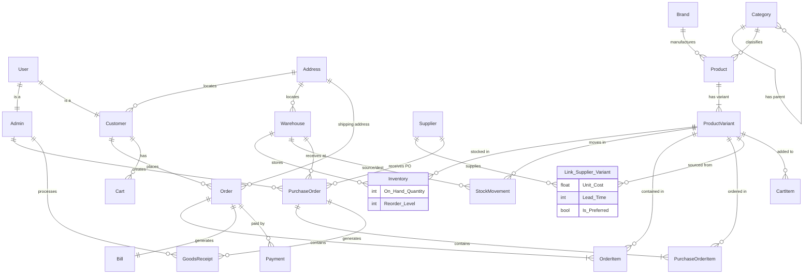

# Inventory-Hub: Database System Report

**Date:** January 18, 2026
**Project:** Inventory Management System (Inventory-Hub)

---

## 1. Project Brief Description

**Inventory-Hub** is a robust, web-based inventory management application designed to streamline supply chain operations for retail and wholesale businesses. It facilitates the end-to-end tracking of products from procurement to sales, ensuring real-time visibility into stock levels, stock movements, and financial metrics.

**Main Functionality:**
*   **Inventory Management:** Real-time tracking of product variants (SKUs) across multiple warehouses. Automatic calculation of on-hand quantities and reorder levels.
*   **Product Catalog:** Comprehensive management of products, brands, and hierarchical categories, with support for product variants (Size, Color, Material).
*   **Supplier Relationship Management (SRM):** Linking suppliers to specific product variants with support for preferred suppliers, unit costs, and lead times.
*   **Procurement:** creation and tracking of Purchase Orders (POs) and Goods Receipts, integrating directly with inventory levels.
*   **Sales & Order Processing:** Management of customer orders, billing, and payments, with automatic stock deduction upon shipment.
*   **Stock Movements:** detailed audit trail of all inventory changes (Inbound, Sale, Return, Adjustment, Transfer), providing full accountability.
*   **Reporting & Analytics:** Dashboard for inventory valuation, low stock alerts, and warehouse distribution analysis.

---

## 2. Entity Sets and Relationship Sets

### Entity Sets
*   **User:** Base entity for system users (ID, Name, Email, Password, Status).
*   **Admin:** Privileged users who manage the system and process POs/receipts.
*   **Customer:** End-users who place orders.
*   **Address:** Physical locations for customers and warehouses.
*   **Warehouse:** Physical storage facilities for inventory.
*   **Category:** Hierarchical classification of products (Self-referencing).
*   **Brand:** Manufacturers or brand identities of products.
*   **Product:** General product definitions.
*   **ProductVariant:** Specific sellable units (SKUs) derived from products.
*   **Supplier:** External entities providing goods.
*   **PurchaseOrder:** Orders placed to suppliers for replenishment.
*   **GoodsReceipt:** Record of goods physically received at a warehouse against a PO.
*   **Cart:** Temporary storage of items for customers before checkout.
*   **Order:** Confirmed customer requests for products.
*   **Bill:** Invoice generated for an Order.
*   **Payment:** Financial transaction record for an Order.

### Relationship Sets
1.  **Address & PostalLookup**: Each **Address** references a **Postal Code** to derive City and State.
2.  **Warehouse & Address**: Each **Warehouse** is located at a specific **Address**.
3.  **Product & Brand**: Each **Product** belongs to exactly one **Brand**.
4.  **Product & Category**: Each **Product** belongs to exactly one **Category**.
5.  **Category Hierarchy**: Each **Category** can optionally belong to a parent **Category** (Recursive).
6.  **ProductVariant & Product**: Each **Product Variant** (SKU) is a specific instance of a parent **Product**.
7.  **Inventory (M:N)**: Links **Warehouse** and **ProductVariant**, defining the quantity on hand for each variant at each location.
8.  **StockMovement**: Each movement record links a **ProductVariant** to a **Warehouse** to track inventory changes.
9.  **Cart & Customer**: Each **Cart** belongs to a registered **Customer**.
10. **CartItem**: Links a **Cart** to specific **ProductVariants** (Many-to-Many logic resolved via bridge table).
11. **Order & Customer**: Each **Order** is placed by one **Customer**.
12. **Order & Address**: Each **Order** is linked to a shipping **Address**.
13. **OrderItem**: Links an **Order** to specific **ProductVariants**, recording the price at the time of purchase.
14. **Bill & Order**: Each **Bill** is generated for exactly one **Order**.
15. **Payment & Order**: Multiple **Payments** can be made against a single **Order**.
16. **Phone_Supplier**: A **Supplier** can have multiple phone numbers (Multivalued attribute normalized).
17. **SupplierProductVariant (M:N)**: Links **Supplier** and **ProductVariant**, allowing a variant to be sourced from multiple suppliers (and vice versa).
18. **PurchaseOrder & Supplier**: Each **Purchase Order** is issued to one **Supplier**.
19. **PurchaseOrder & Admin**: Each **Purchase Order** is created by a specific **Admin**.
20. **PurchaseOrder & Warehouse**: Each **Purchase Order** is destined for a specific **Warehouse**.
21. **PurchaseOrderItem**: Links a **Purchase Order** to specific **ProductVariants**.
22. **GoodsReceipt & PurchaseOrder**: Each **Goods Receipt** corresponds to exactly one **Purchase Order** (1:1 for full receipts).
23. **GoodsReceipt & Admin**: Each **Goods Receipt** is processed/received by an **Admin**.

---

## 3. ER Diagram



---

## 4. Database Schema (DDL)

The database `STORE_DB` is implemented using MySQL. Below is the simplified schema definition for key tables.

```sql
/* USERS & ACTORS */
CREATE TABLE Admin (
  Admin_ID INT PRIMARY KEY AUTO_INCREMENT,
  Full_Name VARCHAR(120) NOT NULL,
  Email VARCHAR(120) NOT NULL UNIQUE
);

CREATE TABLE Customer (
  Customer_ID INT PRIMARY KEY AUTO_INCREMENT,
  Full_Name VARCHAR(120) NOT NULL,
  Email VARCHAR(120) NOT NULL UNIQUE,
  Status VARCHAR(30) CHECK (Status in ("ACTIVE", "INACTIVE"))
);

/* PRODUCT CATALOG */
CREATE TABLE Product (
  Product_ID INT AUTO_INCREMENT PRIMARY KEY,
  Brand_ID INT NOT NULL,
  Category_ID INT NOT NULL,
  Product_Name VARCHAR(50) NOT NULL,
  FOREIGN KEY (Brand_ID) REFERENCES Brand(Brand_ID),
  FOREIGN KEY (Category_ID) REFERENCES Category(Category_ID)
);

CREATE TABLE ProductVariant (
  Product_Variant_ID INT AUTO_INCREMENT PRIMARY KEY,
  Product_ID INT NOT NULL,
  SKU VARCHAR(50) NOT NULL UNIQUE,
  Color VARCHAR(40),
  Size VARCHAR(40),
  Unit_Price real NOT NULL,
  FOREIGN KEY (Product_ID) REFERENCES Product(Product_ID)
);

/* INVENTORY CORE */
CREATE TABLE Inventory (
  Warehouse_ID INT NOT NULL,
  Product_Variant_ID INT NOT NULL,
  On_Hand_Quantity INT NOT NULL,
  Reorder_Level INT NOT NULL,
  PRIMARY KEY (Warehouse_ID, Product_Variant_ID),
  FOREIGN KEY (Warehouse_ID) REFERENCES Warehouse(Warehouse_ID),
  FOREIGN KEY (Product_Variant_ID) REFERENCES ProductVariant(Product_Variant_ID)
);

CREATE TABLE StockMovement (
  Movement_ID INT AUTO_INCREMENT PRIMARY KEY,
  Warehouse_ID INT NOT NULL,
  Product_Variant_ID INT NOT NULL,
  Quantity_Change INT NOT NULL,
  Movement_Type VARCHAR(30) NOT NULL,
  Reference_Type VARCHAR(20),
  Movement_Date DATETIME NOT NULL
);

/* SUPPLIER & ORDERING */
CREATE TABLE SupplierProductVariant (
  Supplier_ID INT NOT NULL,
  Product_Variant_ID INT NOT NULL,
  Preferred_Flag BOOLEAN DEFAULT FALSE,
  Unit_Cost REAL,
  PRIMARY KEY (Supplier_ID, Product_Variant_ID)
);

CREATE TABLE PurchaseOrder (
  PO_ID INT AUTO_INCREMENT PRIMARY KEY,
  Supplier_ID INT NOT NULL,
  Created_By_Admin_ID INT NOT NULL,
  Status VARCHAR(10) NOT NULL CHECK (Status IN ('PENDING','RECEIVED', 'CANCELLED')),
  Order_Date DATE NOT NULL
);
```

---

## 5. Key Queries (Analysis)

The system utilizes complex SQL queries to generate reports and filter data efficiently.

### A. Inventory Valuation with Filtering
This query joins 6 tables to provide a complete view of inventory, including calculating unit costs dynamically from the preferred supplier allocation.

```sql
SELECT 
    i.Warehouse_ID,
    w.Name as Warehouse_Name,
    p.Product_Name,
    pv.SKU,
    pv.Unit_Price,
    (
        -- Subquery to fetch cost from the preferred supplier
        SELECT spv.Unit_Cost 
        FROM SupplierProductVariant spv 
        WHERE spv.Product_Variant_ID = i.Product_Variant_ID 
        ORDER BY spv.Preferred_Flag DESC, spv.Unit_Cost DESC 
        LIMIT 1
    ) as Unit_Cost,
    i.On_Hand_Quantity,
    i.Reorder_Level
FROM Inventory i
JOIN Warehouse w ON i.Warehouse_ID = w.Warehouse_ID
JOIN ProductVariant pv ON i.Product_Variant_ID = pv.Product_Variant_ID
JOIN Product p ON pv.Product_ID = p.Product_ID
JOIN Category c ON p.Category_ID = c.Category_ID
JOIN Brand b ON p.Brand_ID = b.Brand_ID
WHERE 
    i.Warehouse_ID = %s 
    AND i.On_Hand_Quantity <= COALESCE(NULLIF(i.Reorder_Level, 0), 10) -- Low Stock Logic
ORDER BY p.Product_Name ASC;
```

### B. Stock Movement Audit Trail
This query retrieves the history of stock changes with multi-conditional filtering for audit purposes.

```sql
SELECT 
    sm.Movement_ID,
    sm.Movement_Type,
    sm.Quantity_Change,
    sm.Movement_Date,
    p.Product_Name,
    pv.SKU,
    w.Name as Warehouse_Name
FROM StockMovement sm
JOIN ProductVariant pv ON sm.Product_Variant_ID = pv.Product_Variant_ID
JOIN Product p ON pv.Product_ID = p.Product_ID
JOIN Warehouse w ON sm.Warehouse_ID = w.Warehouse_ID
WHERE 
    sm.Movement_Date >= %s 
    AND sm.Movement_Date <= %s
    AND (
        p.Product_Name LIKE %s OR 
        pv.SKU LIKE %s OR 
        sm.Movement_Type = %s
    )
ORDER BY sm.Movement_Date DESC;
```

---

## 6. Normalization Analysis (3NF)

The database schema has been rigorously analyzed to ensure adherence to the Third Normal Form (3NF).

**1. First Normal Form (1NF):**
*   All attributes are atomic (no multi-valued attributes like listing multiple phone numbers in one cell).
*   No repeating groups.
*   **Status:** Satisfied.

**2. Second Normal Form (2NF):**
*   All relations are in 1NF.
*   No partial dependency: All non-key attributes are fully dependent on the **entire** primary key.
*   *Example:* In `Inventory (Warehouse_ID, Product_Variant_ID)`, the `On_Hand_Quantity` depends on *both* the warehouse and the specific item, not just one.
*   **Status:** Satisfied.

**3. Third Normal Form (3NF):**
*   All relations are in 2NF.
*   No transitive dependency: Non-key attributes depend **only** on the primary key, not on other non-key attributes.
*   *Example:* `PostalLookup` table was created to separate `City` and `State` from `Address`, removing the transitive dependency `Postal_Code -> City`.
*   *Example:* `SupplierProductVariant` isolates cost data, ensuring `ProductVariant` doesn't depend on `Supplier` columns transitively.
*   **Status:** Satisfied.

**Conclusion:**
The `STORE_DB` schema is fully normalized to 3NF, ensuring data integrity, minimizing redundancy, and preventing update anomalies.
